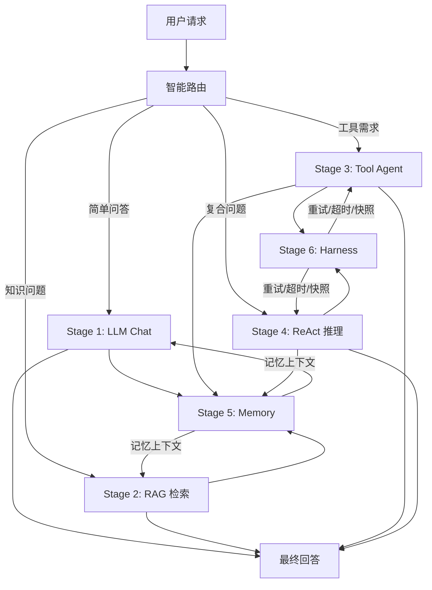

# Final Stage：全阶段整合 AI 助手

## 简介

将 6 个阶段的能力整合为一个统一的 AI 助手。智能路由用户请求，自动选择最合适的处理模式。

## 架构



## 智能路由逻辑

| 请求特征 | 路由到 | 示例 |
|----------|--------|------|
| 简单问答，无需工具/知识库 | Stage 1 Chat | "你是谁？"、"解释后端工程师" |
| 知识库已加载 + 知识性问题 | Stage 2 RAG | "Go语言有什么特点？" |
| 需要调用工具（时间/天气/搜索） | Stage 3 Tool | "现在几点？"、"东京天气？" |
| 2个以上子需求 | Stage 4 ReAct + Stage 6 Harness | "现在几点+东京天气+总结" |
| 包含偏好/记忆触发词 | Stage 5 Memory 叠加 | "我喜欢周杰伦" + "推荐音乐" |

## API 配置

编辑 `config/config.go`：

| 配置项 | 说明 | 用于阶段 |
|--------|------|---------|
| `LLMAPIUrl` / `LLMAPIKey` | 聊天模型 | Stage 1,3,4,6 |
| `LLMModel` | 模型名称 | - |
| `EmbeddingAPIUrl` / `EmbeddingAPIKey` | 向量化模型 | Stage 2,5 |
| `ChunkSize` / `TopK` | RAG 参数 | Stage 2 |
| `ShortTermMaxTurns` / `LongTermTopK` | 记忆参数 | Stage 5 |
| `MaxRetries` / `StepTimeoutMs` | 稳定性参数 | Stage 6 |
| `MaxIterations` | ReAct 迭代限制 | Stage 4 |

## 运行

```bash
cd demos/final
go run main.go
# 访问 http://localhost:8090
```

## 目录结构

```
final/
├── README.md
├── go.mod
├── config/
│   └── config.go        # 全部 API 配置
├── main.go              # 后端：整合所有阶段引擎
└── frontend/
    └── index.html       # 前端：统一聊天界面
```

## API 接口

| 接口 | 方法 | 说明 |
|------|------|------|
| `/api/chat` | POST | 统一对话入口（智能路由） |
| `/api/upload` | POST | 上传文档到知识库 |
| `/api/memory` | GET | 查看记忆状态 |
| `/api/tools` | GET | 查看可用工具 |
| `/api/snapshots` | GET | 查看快照列表 |
| `/api/status` | GET | 查看系统状态 |
