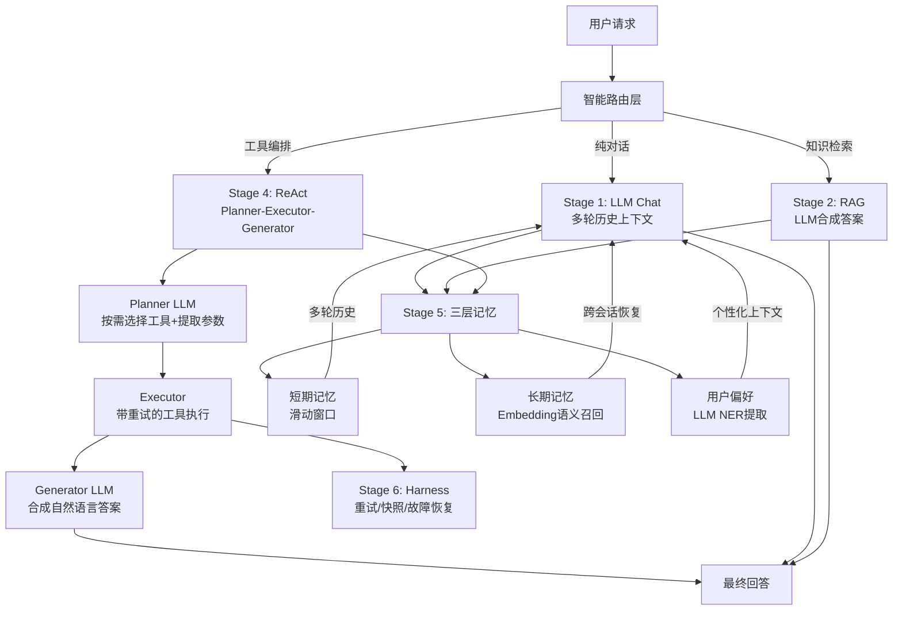

# Final Stage：生产级全栈 AI Agent 系统

## 项目简介

从零构建一个**生产级全栈 AI Agent**，整合 6 大核心能力模块，实现智能路由、多轮记忆、知识增强检索、工具编排与多步推理。后端使用 Python（FastAPI + uvicorn），前端单页应用，支持真实 LLM API 对接与完整基础设施集成。

---

## 系统架构



---

## 六大核心能力

### Stage 1 · 多轮对话（LLM Chat）
- 接入 OpenAI 兼容接口（火山方舟 / 任意兼容厂商）
- **多轮历史**：将 STM 滑动窗口消息完整传入每次 LLM 调用，彻底解决对话失忆
- 无 API Key 时自动降级为 Mock 模式

### Stage 2 · 知识增强检索（RAG）
- 文档上传 → Unicode 安全文本分割 → TF 词袋向量索引
- 召回 Top-K 相关 Chunk → **Generator LLM 合成答案**（非原始 chunk 拼接）
- RAG 作为**可选工具**出现在工具选择器中，支持显式调用

### Stage 3 · 工具调用（Tool Agent）
- 内置工具：`get_time`、`get_weather`、`search_web`
- `search_web` 双层实现：**Tavily 真实网络搜索**（配置 API Key 后启用）→ 降级为 LLM 知识库回答
- 自动路由（无工具选择时）：基于关键词判断调用哪个工具

### Stage 4 · 多步推理（ReAct + Planner-Executor-Generator）

**核心架构升级**：告别全量工具盲目执行，改为三段式智能编排：

```
Planner LLM     →     Executor     →     Generator LLM
分析 query           按计划执行工具         综合所有观察
按需选工具           带重试 + 快照          合成自然语言答案
提取正确参数         返回结构化步骤
```

- Planner 输出 JSON 计划（含调用理由），前端展示为 `💭 思考` 步骤
- 用户选 3 个工具但只问天气 → Planner 只调 `get_weather`，不做无意义调用
- LLM 不可用时降级为关键词规则规划

### Stage 5 · 三层记忆（Memory）
| 层级 | 实现 | 持久化 |
|------|------|--------|
| 短期记忆 | 滑动窗口（最近 N 轮） | 内存，随会话清除 |
| 长期记忆 | Embedding 语义向量优先，TF 词袋降级 | PostgreSQL `long_term_memory` 表 |
| 用户偏好 | **LLM NER 提取**（任意偏好格式），规则兜底 | PostgreSQL `user_preferences` 表 |

- **跨会话恢复**：服务启动时从 PG 加载历史偏好和长期记忆
- 偏好异步提取（不阻塞响应），规则同步提取（立即展示通知）

### Stage 6 · 稳定执行（Harness）
- 每步工具调用带**重试机制**（可配置次数 + 延迟）
- 每步执行后**保存快照**到 PostgreSQL，支持故障恢复
- 结合 ReAct 实现完整的 Observe-Think-Act 循环

---

## 工具系统

### 内置工具
| 工具 | 功能 | 实现 |
|------|------|------|
| `get_time` | 获取当前时间（支持时区） | 本地系统调用 |
| `get_weather` | 获取城市天气 | 模拟数据库（可替换真实 API） |
| `search_web` | 互联网搜索 | Tavily API → LLM 知识库双层降级 |
| `rag_search` | 私人知识库检索 | RAG Engine，需先上传文档 |

### MCP 动态工具接入
```bash
POST /api/tools/mcp
{
  "name": "my_tool",
  "description": "工具描述",
  "endpoint": "http://your-service/tool",
  "params": [{"name": "query", "type": "string", "required": true}]
}
```
- 注册后立即出现在工具选择器中，标注 `MCP` 角标
- Planner LLM 自动为 MCP 工具提取参数

---

## 基础设施集成

| 组件 | 用途 | 降级策略 |
|------|------|---------|
| PostgreSQL | 偏好/长期记忆/任务快照持久化 | 内存模式 |
| Milvus | 向量近邻搜索（生产 RAG） | 内存 TF 向量库 |
| Elasticsearch | 全文检索增强 | 跳过 |
| Kafka | Agent 事件流（`agent.chat` / `rag.ingest`） | 日志输出降级 |

所有基础设施**连接失败均优雅降级**，不影响核心功能启动。

---

## 前端设计

- **左侧边栏**：私人黑洞（拖拽上传 RAG 文档）+ 近期对话（最多 5 条，支持删除）
- **控制栏**：知识库开关 + 工具多选器（含 MCP 注册入口）
- **思考过程可视化**：工具执行时自动展开，逐步展示 `💭思考 → ⚡动作 → 👁观察 → ✅汇总`
- **会话持久化**：localStorage，刷新不丢失历史

---

## API 接口

| 接口 | 方法 | 说明 |
|------|------|------|
| `/api/chat` | POST | 统一对话入口（智能路由 + 显式工具控制） |
| `/api/upload` | POST | 上传文档到私人知识库 |
| `/api/memory` | GET | 查看三层记忆状态 |
| `/api/tools` | GET | 列出所有可用工具（含 MCP） |
| `/api/tools/mcp` | POST | 动态注册 MCP 工具 |
| `/api/snapshots` | GET | 查看任务执行快照 |
| `/api/status` | GET | 系统状态与配置摘要 |

---

## 配置

所有配置集中在 `config/config.yaml`，无需环境变量：

```yaml
llm:
  api_url: https://ark.cn-beijing.volces.com/api/v3/chat/completions
  api_key: "your-key"
  model: ep-xxxx
  temperature: 0.7

embedding:
  api_url: https://ark.cn-beijing.volces.com/api/v3/embeddings
  api_key: "your-key"
  model: ep-xxxx

# 可选：真实网络搜索（Tavily 免费额度 1000次/月）
search:
  api_key: "tvly-xxx"

rag:
  chunk_size: 200
  chunk_overlap: 50
  top_k: 3

memory:
  short_term_max_turns: 5
  long_term_top_k: 3

harness:
  max_retries: 3
  retry_delay_ms: 200
```

---

## 目录结构

```
final/
├── config/
│   ├── config.py          # 配置加载（PyYAML，cwd 解耦）
│   └── config.yaml        # 唯一配置源
├── internal/
│   ├── agent/
│   │   └── agent.py       # 核心调度器：路由/ReAct/Planner/Generator/Memory
│   ├── llm/
│   │   └── llm.py         # LLM Client：Chat / Embed / ExtractPreferences（OpenAI 兼容）
│   ├── memory/
│   │   └── memory.py      # 三层记忆：STM / LTM(Embedding) / Preference
│   ├── rag/
│   │   └── rag.py         # RAG Engine：分割/向量化/检索/LLM合成 + RRF 融合
│   ├── tools/
│   │   └── tools.py       # 工具注册：内置工具 + MCP 工厂
│   ├── handler/
│   │   └── handler.py     # FastAPI 路由：Pydantic + CORS + /health
│   └── infra/
│       └── infra.py       # 基础设施：PG / Milvus / ES / Kafka
├── frontend/
│   └── index.html         # 单页前端
├── main.py                # 入口（uvicorn 启动）
├── requirements.txt
├── Dockerfile             # python:3.11-slim
└── docker-compose.yml     # app + PG + ES + Milvus + Kafka 全套
```

---

## 快速启动

```bash
cd final

# 本地直接运行（需 Python 3.11+）
pip install -r requirements.txt
python main.py
# 访问 http://localhost:8080

# Docker Compose（含完整基础设施：PG / ES / Milvus / Kafka）
docker compose up -d --build
```

> 无需任何基础设施也能启动——全部优雅降级为内存模式，只需在 `config.yaml` 填入 LLM API Key 即可体验完整对话能力。
