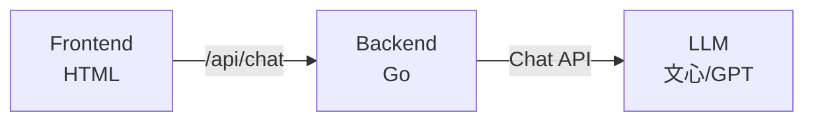

# Stage 1：基础聊天助手 (LLM Wrapper)

## 简介

最简单的 AI 助手，封装 LLM API 实现基础问答能力。所有后续阶段都依赖此核心调用链路。

## 架构



## 功能

- 用户输入 → 调用 LLM → 返回结果
- 支持温度调节（Temperature）
- 系统角色设定（System Prompt）

## API 配置

编辑 `config/config.go`，填入你的 LLM API 信息：

| 配置项 | 说明 | 示例 |
|--------|------|------|
| `LLMAPIUrl` | 聊天模型 API 地址 | `https://aip.baidubce.com/.../completions` |
| `LLMAPIKey` | API Key | 你的密钥 |
| `LLMModel` | 模型名称 | `ernie-bot-4` |
| `Temperature` | 温度参数 | `0.7` |

> 不填 API Key 时自动使用模拟 LLM，可直接运行体验。

## 运行

```bash
cd demos/stage1
go run main.go
# 访问 http://localhost:8081
```

## 目录结构

```
stage1/
├── README.md           # 本文件
├── go.mod              # Go module
├── config/
│   └── config.go       # API 配置（LLM 模型地址、Key 等）
├── main.go             # 后端 HTTP 服务 + LLM 调用逻辑
└── frontend/
    └── index.html      # 前端聊天界面
```
