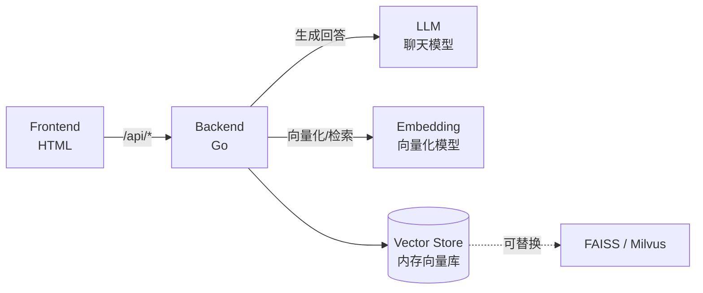

# Stage 2：RAG 知识库助手

## 简介

让 AI 助手拥有知识库，基于文档内容回答问题，而不是瞎编。这是商业价值的核心——80% 的公司只需要 RAG。

## 架构



## 功能

- 上传文档 → 自动切分 + 向量化存储
- 基于知识库检索 + 生成回答
- RAG vs 无 RAG 对比

## API 配置

编辑 `config/config.go`：

| 配置项 | 说明 | 用途 |
|--------|------|------|
| `LLMAPIUrl` | 聊天模型 API 地址 | **生成最终回答** |
| `LLMAPIKey` | 聊天模型 API Key | - |
| `LLMModel` | 聊天模型名称 | 如 `ernie-bot-4` |
| `EmbeddingAPIUrl` | 向量化模型 API 地址 | **文档向量化 + 检索** |
| `EmbeddingAPIKey` | 向量化模型 API Key | - |
| `EmbeddingModel` | 向量化模型名称 | 如 `embedding-v1` |
| `ChunkSize` | 切片大小 | 200 字符 |
| `TopK` | 检索文档数 | 3 |

## 运行

```bash
cd demos/stage2
go run main.go
# 访问 http://localhost:8082
```

## 目录结构

```
stage2/
├── README.md
├── go.mod
├── config/
│   └── config.go       # API 配置（聊天模型 + 向量化模型）
├── main.go             # 后端 HTTP 服务 + RAG 逻辑
└── frontend/
    └── index.html      # 前端界面（上传文档 + 问答）
```
