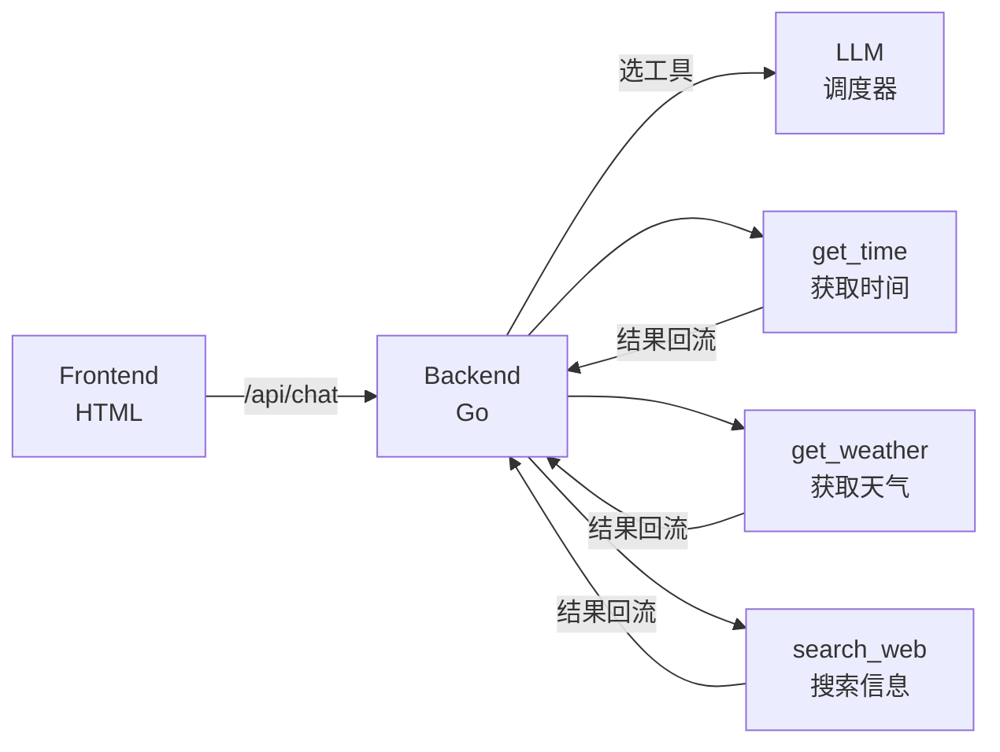

# Stage 3：Tool Agent (工具调用)

## 简介

让 AI 助手"动起来"——从聊天进化为动作。LLM 变成调度器，根据用户意图自动选择并调用工具。

## 架构



## 功能

- 3 个内置工具：get_time / get_weather / search_web
- LLM 自动分析意图并选择工具
- Tool Schema (JSON) 定义工具能力
- 工具执行结果回流给 LLM 生成自然语言回答

## API 配置

编辑 `config/config.go`：

| 配置项 | 说明 | 用途 |
|--------|------|------|
| `LLMAPIUrl` | 聊天模型 API 地址 | **意图理解 + 工具选择 + 回答生成** |
| `LLMAPIKey` | API Key | - |
| `LLMModel` | 模型名称 | 如 `ernie-bot-4` |
| `Temperature` | 温度参数 | 工具选择建议低温度 (0.3) |

## 运行

```bash
cd demos/stage3
go run main.go
# 访问 http://localhost:8083
```

## 目录结构

```
stage3/
├── README.md
├── go.mod
├── config/
│   └── config.go       # API 配置（LLM 调度器）
├── main.go             # 后端 + 工具定义 + Agent 逻辑
└── frontend/
    └── index.html      # 前端界面（聊天 + 工具调用展示）
```
