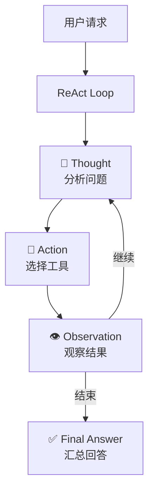

# Stage 4：ReAct AI 助手 (多步推理)

## 简介

核心分水岭——让 AI 助手"自己拆步骤做事"。实现 Thought → Action → Observation 循环，从工具调用进化为自主决策。

## 架构



## 功能

- 自动拆解复合问题为多步推理
- 每步日志记录（Thought / Action / Observation）
- 最大迭代限制防止死循环
- 最终汇总生成回答

## API 配置

编辑 `config/config.go`：

| 配置项 | 说明 | 用途 |
|--------|------|------|
| `LLMAPIUrl` | 聊天模型 API 地址 | **多步推理 + 工具选择 + 总结** |
| `LLMAPIKey` | API Key | - |
| `LLMModel` | 模型名称 | 如 `ernie-bot-4` |
| `MaxIterations` | 最大迭代次数 | 防止死循环，默认 5 |

## 运行

```bash
cd demos/stage4
go run main.go
# 访问 http://localhost:8084
```

## 目录结构

```
stage4/
├── README.md
├── go.mod
├── config/
│   └── config.go       # API 配置（LLM 推理模型 + 迭代限制）
├── main.go             # 后端 + ReAct 引擎
└── frontend/
    └── index.html      # 前端界面（推理过程可视化）
```
