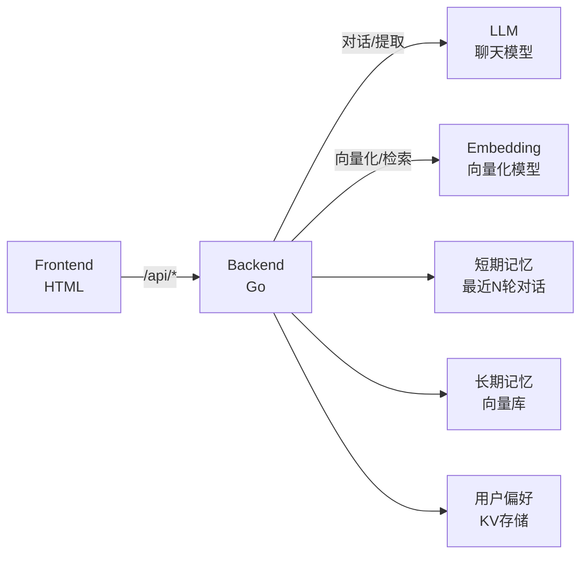

# Stage 5：带记忆的 AI 助手 (Memory)

## 简介

让助手开始有"人味"——记住用户的偏好和重要信息，从工具进化为个人助手。

## 架构



## 功能

- **短期记忆**：保留最近 3~5 轮对话
- **长期记忆**：向量库存储重要信息，支持相似度检索
- **用户偏好**：key-value 存储（如喜欢的音乐、姓名等）
- 自动从对话中提取重要信息

## API 配置

编辑 `config/config.go`：

| 配置项 | 说明 | 用途 |
|--------|------|------|
| `LLMAPIUrl` | 聊天模型 API 地址 | **对话 + 信息提取 + 总结** |
| `LLMAPIKey` | API Key | - |
| `EmbeddingAPIUrl` | 向量化模型 API 地址 | **长期记忆向量化 + 检索** |
| `EmbeddingAPIKey` | API Key | - |
| `ShortTermMaxTurns` | 短期记忆轮数 | 默认 5 |
| `LongTermTopK` | 长期记忆检索数 | 默认 3 |

## 运行

```bash
cd demos/stage5
go run main.go
# 访问 http://localhost:8085
```

## 目录结构

```
stage5/
├── README.md
├── go.mod
├── config/
│   └── config.go       # API 配置（聊天模型 + 向量化模型）
├── main.go             # 后端 + 记忆管理器
└── frontend/
    └── index.html      # 前端界面（聊天 + 记忆面板）
```
