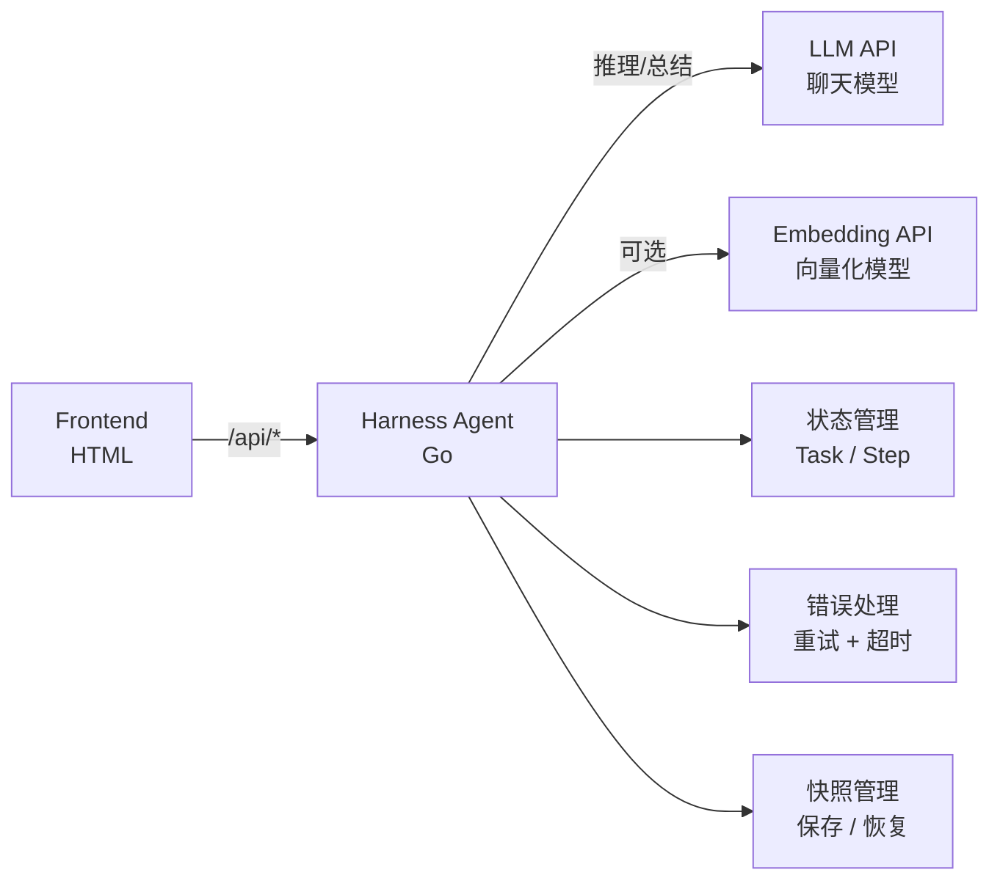

# Stage 6：稳定 AI 助手 (Harness)

## 简介

工程级 AI 助手，解决真实线上问题：状态管理、错误重试、超时控制、快照恢复。直接拉开档次。

## 架构



## 功能

- **状态管理**：任务状态 + 执行步骤跟踪
- **错误处理**：工具失败自动重试（最多 3 次）
- **超时控制**：单步执行超时自动中断
- **快照恢复**：序列化任务状态，中断后可恢复继续

## API 配置

编辑 `config/config.go`：

| 配置项 | 说明 | 用途 |
|--------|------|------|
| `LLMAPIUrl` | 聊天模型 API 地址 | **推理 + 总结** |
| `LLMAPIKey` | API Key | - |
| `EmbeddingAPIUrl` | 向量化模型 API 地址 | **长期记忆（可选）** |
| `EmbeddingAPIKey` | API Key | - |
| `MaxRetries` | 最大重试次数 | 默认 3 |
| `RetryDelayMs` | 重试间隔(ms) | 默认 200 |
| `StepTimeoutMs` | 单步超时(ms) | 默认 5000 |

## 运行

```bash
cd demos/stage6
go run main.go
# 访问 http://localhost:8086
```

## 目录结构

```
stage6/
├── README.md
├── go.mod
├── config/
│   └── config.go       # API 配置（LLM + Embedding + 重试/超时参数）
├── main.go             # 后端 + Harness 引擎
└── frontend/
    └── index.html      # 前端界面（任务管理 + 快照恢复）
```
